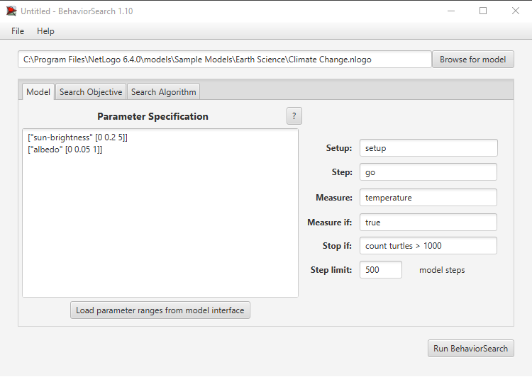
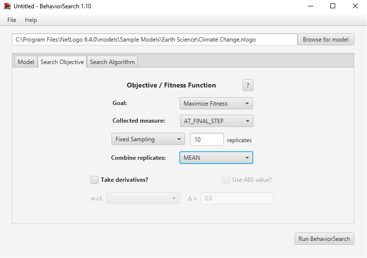
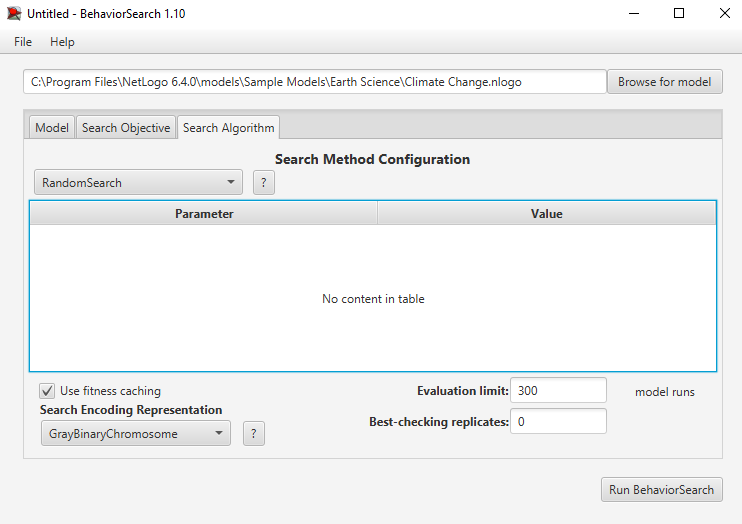
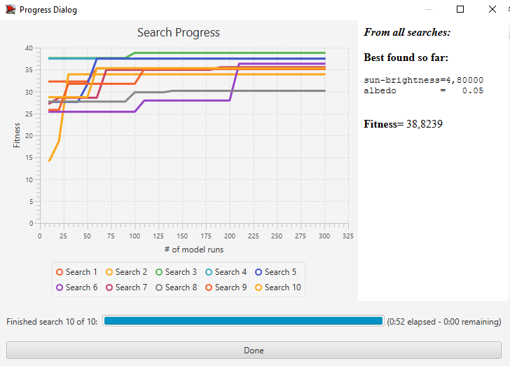
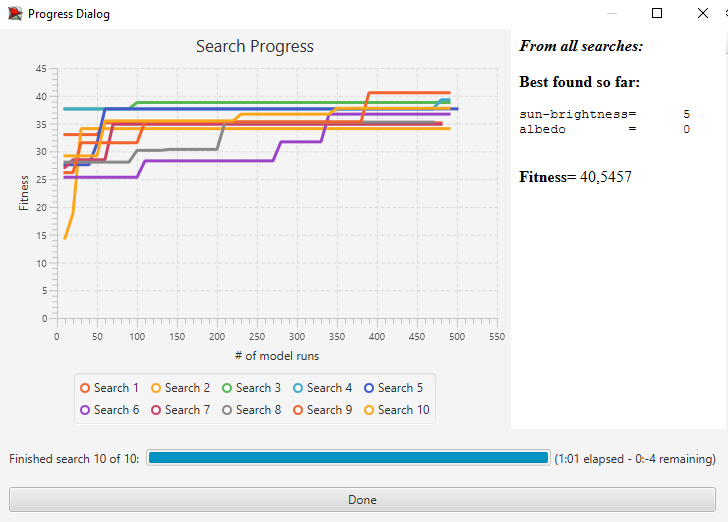

## Комп'ютерні системи імітаційного моделювання
## СПм-22-3, **Ніколаєнко Дмитро Сергійович**
### Лабораторна робота №**3**. Використання засобів обчислювального інтелекту для оптимізації імітаційних моделей

<br>

### Варіант 2, модель у середовищі NetLogo:
[Climate Change](https://www.netlogoweb.org/launch#http://www.netlogoweb.org/assets/modelslib/Sample%20Models/Earth%20Science/Climate%20Change.nlogo)

<br>

### Вербальний опис моделі:
Модель "Climate Change" досліджує вплив різних факторів на температуру Землі, зосереджуючись на таких аспектах, як альбедо земної поверхні, хмарність, кількість вуглекислого газу в атмосфері, інтенсивність сонячного світла. Модель показує залежність глобальної температури відносно заданих параметрів. 

### Керуючі параметри:
- **sun-brightness** визначає частоту падіння сонячних променів.
- **albedo** визначає ступінь відбиття земною поверхнею сонячних променів. Чим більший показник альбедо, тим більше променів відбивається поверхнею.
- **clouds** визначає кількість хмар у небі. Хмари здатні відбивати сонячні промені.
- **CO2** визначає кількість молекул CO2 у повітрі. Молекули CO2 відбивають тепло, яке виходить з земної поверхні.

### Внутрішні параметри:
- **sky-top**. Верхня точка неба. Обмежує площу появи хмар та молекул СO2.
- **earth-top**. Верхня точка земної поверхні.
- **temperature**. Показник температури земної поверхні.

### Показники роботи системи:
- Залежність температури від часу. Графік, який показує, як змінюється температура земної поверхні з плином часу відносно наших заданих параметрів.

### Примітки:
При налаштуваннях краще не обирати занадно великі показники кількості хмар та/або вуглекислого газу. Це сприяє великому навантаженню на моделюванная та може спричинити неможливість контролювати імітацію.

### Недоліки моделі:
Основним недоліком моделі можна назвати її обмеженість. В моделі не змінюється угол нахилу сонячних променів відносно часу, неможливо додати або видалити конкретну кількість хмар або молекул CO2, вони задаються рандомним або статичним значенням. Неможливо задати стартове значення температури земної поверхні, змінити швидкість руху об'єктів. Модель не враховує багато факторів, які можуть впливати на результати симуляції, такі як, дощ, пора року.

### Налаштування середовища BehaviorSearch:
Обрана модель:
C:\Program Files\NetLogo 6.3.0\models\Sample Models\Earth Science\Climate Change.nlogo

### Параметри моделі:
Параметри та їх діапазони були автоматично вилучені середовищем BehaviorSearch із вибраної імітаційної моделі, для цього скористаємось кнопкою «Load parameter ranges from model interface»:
```
["sun-brightness" [0 0.2 5]]
["albedo" [0 0.05 1]]
```

### Міра фітнес-функції
В якості міри для фітнес-функції використано значення температури. Вираз цієї міри узято з налаштувань графіка імітаційної моделі в середовищі NetLogo:
```
plot temperature
```
Скриншот панелі налаштування параметрів приведено на малюнку:


### Налаштування цільової функції (Search Objective)
Метою підбору параметрів імітаційної моделі є мінімізація значення вбивст збирачів у середовищі існування (тобто знайти такі параметри налаштуванн моделі, при яких значення числа вбивст найменше).

Ми вказуємо це за допомогою значення Minimize Fitness в параметрі "Goal". При чому, важливо, що нас має цікавити не значення популяції в окремий момент симуляції, а середнє значення протягом всієї симуляції, тривалість якої 500 кроків. Для цього в параметрі "Collected measure" вказуємо значення MEAN_ACROSS_STEPS. Щоб уникнути спотворення результатів через випадкові значення, що використовуються в логіці самої імітаційної моделі, кожна симуляція повторюється по 10 разів, результат розраховується як середнє арифметичне.

Скриншот панелі налаштування параметрів цільової функції:


### Налаштування алгоритму пошуку (Search Algorithm)
На цьому етапі було визначено модель, налаштовані її параметри, і вибрано міру ефективності, що лежить в основі функції пристосованості, що дозволяє оцінити "якість" кожного з варіанта рішення, що перевіряється BehaviorSearch. У ході дослідження будуть використовуватися два алгоритми: Випадковий пошук (RandomSearch) і Простий генетичний алгоритм (StandardGA). Для цих алгоритмів необхідно вказати "Evaluation limit" (число ітерацій пошуку, у разі GA - це буде число поколінь), та "Search Space Encoding Representation" (спосіб кодування варіанта рішення). Загальноприйнятого "кращого" способу кодування немає, неохідно визначити, які підходять для поточної моделі. Параметр "Use fitness caching" впливає тільки на продуктивність.


#### Налаштування RandomSearch алгоритму пошуку:

Результати для RandomSearch алгоритму пошуку:

``` 
From all searches:

Best found so far:

sun-brightness=4,80000
albedo        =   0.05

Fitness= 38,8239
```

#### Налаштування StandardGA алгоритму пошуку:

Результати для StandardGA алгоритму пошук:


```
Best found so far:
initial-fruit-bushes=      4
initial-foragers    =     26
bush-growth-chance  =     94
ticks-to-flee       =     81
max-age             =     19
collaboration-bonus =1.05069
rate-of-mutation    =    0.4
show-energy?        =   true
visualization       =Proactive Aggression

Fitness= 0.00000
```
